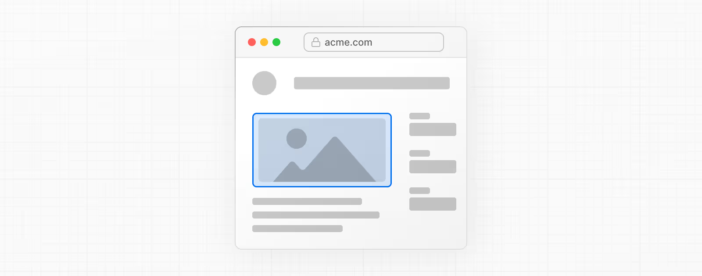

# 如何创建布局和页面

Next.js 使用基于文件系统的路由，这意味着你可以使用文件夹和文件来定义路由。本页面将指导你了解如何创建布局和页面，以及如何在它们之间建立链接。

### 创建页面

页面是在特定路由上呈现的用户界面。要创建一个页面，在 `app` 目录中添加一个页面文件，并默认导出一个 React 组件。例如，要创建一个索引页面（`/`）：

<figure><figcaption></figcaption></figure>

```tsx
export default function Page() {
  return <h1>Hello Next.js!</h1>
}
```

### 创建布局

布局是多个UI所共享的。在导航时，布局会保留
